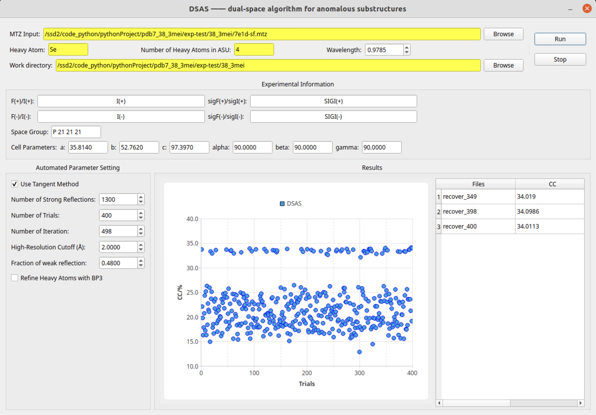

# DSAS
  We have developed a new program, DSAS, based on the modified phase-retrieval algorithm to determine the anomalous scattering substructure. In the DSAS, we developed an automated parameters setting method that can automatically solve the optimal algorithm parameters for different SAD data sets. The program has a user-friendly graphical user interface (GUI), where users only need to input experimental information, and the determination of substructure solution can be automatically completed. Meanwhile, the iterative process can also be real-time monitored through the GUI, which greatly reduces the difficulty of use for users. 


## Requirement
- Linux operating system
- [the modified phase-retrieval algorithm](https://github.com/fuxingke0601/the-modified-phase-retrieval-algorithm)
- python 3.10
- [anaconda](https://www.anaconda.com/download/) for installing PyQt5, numpy and matplotlib libraries
- [GEMMI](https://gemmi.readthedocs.io/en/latest/index.html#) , python library for structural biology

## testting
1. Compiling  
Edit the [the modified phase-retrieval algorithm](https://github.com/fuxingke0601/the-modified-phase-retrieval-algorithm)
2. A test case, 7e1d
 
```bash
python3.10 DSAS.py
```

## The Graphics User Interface (GUI) of DSAS
The DSAS has a user-friendly GUI written in PyQt5. It mainly consists of four panels:   
- **“Inputting Panel”**
- **“Experimental Information Panel”**
- **“Automated Parameters setting Panel”**
- **“Results Panel”**.
- **“Results Panel”**.


<p align="center">

</p>

## The workflow char of DSAS
The DSAS is divided four steps:   
   
&ensp;&ensp;&ensp;&ensp;(1) **Experimental data preprocessing;**   
   
&ensp;&ensp;&ensp;&ensp;(2) **Automated parameters setting;**   
   
&ensp;&ensp;&ensp;&ensp;(3) **Implementation of the modified phase-retrieval algorithm;**   
   
&ensp;&ensp;&ensp;&ensp;(4) **Peak search and refinement.**   

<p align="center">

</p>

## Authors
1. Fu Xingke  
Institute of  Physics, Chinese Academy of Sciences (IOP, CAS)   
Email: fuxingke0601@163.com
2. Qian Liu   
company: Beijing Yunlu Technology Co., Ltd. Beijing 100161, China   
Email: ss818cc@hotmail.com   
3. Geng Zhi   
Institute of High Energy Physics, Chinese Academy of Sciences (IHEP, CAS)   
Email: gengz@ihep.ac.cn   

